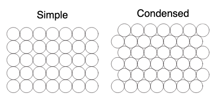

# Barrel-Packing
A short python script to determine whether simple or condensed packing is more efficient to load barrels in a hold. <br> <br>


## Running the Script
```python packHold.py X Y Z```
<br>
<br>
**X:** The radius of the barrels to be packed <br>
**Y:** The width of the hold <br>
**Z:** The length of the hold <br>
